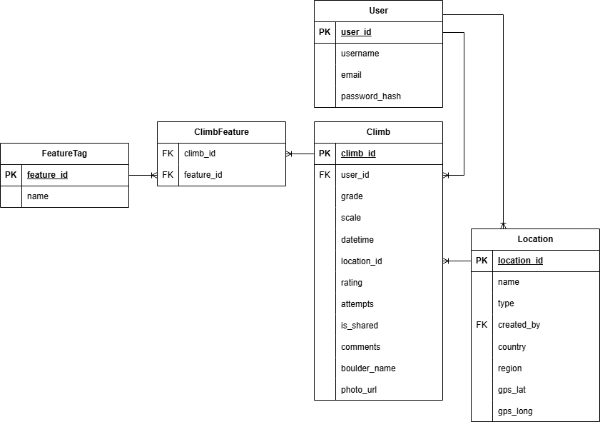

# Bouldering Tracker Web Application

This project is a multi-user web application designed for bouldering enthusiasts to log and track their climbs. Users can record detailed information about each climb, including grade, features, location, and personal notes. The app supports grade conversion between V scale and Font scale, mobile responsiveness, and optional sharing of climbs. It also includes analytics for skill progression based on climb features.

## Features
- **User Authentication**: Secure login and registration.
- **Climb Logging**:
  - Grade (V scale or Font scale)
  - Features (e.g., sloper, crimpy, dynamic)
  - Comments (optional)
  - Boulder name (optional)
  - Photo upload (optional)
  - Date and time of climb
  - Location (linked to Location table)
  - Rating (1–3 stars)
  - Number of attempts (optional)
  - Option to mark climb as shareable
- **Grade Conversion**: Convert between V scale and Font scale.
- **Feature Autocomplete**: Suggest previously used features to avoid spelling inconsistencies.
- **Location Management**:
  - Predefined locations (e.g., gyms)
  - User-generated locations (editable by creator)
  - Optional GPS coordinates for outdoor climbs
- **Skill Graph Analytics**:
  - Radar chart showing proficiency across features
  - Weighted by grade and number of attempts
- **Responsive Design**: Optimized for mobile and desktop.

## Database Entities
### User
- user_id (PK)
- username
- email
- password_hash

### Climb
- climb_id (PK)
- user_id (FK → User)
- grade (string)
- scale (enum: V, Font)
- comment (optional)
- boulder_name (optional)
- photo_url (optional)
- datetime (timestamp)
- location_id (FK → Location)
- rating (int: 1–3)
- attempts (optional)
- is_shared (boolean)

### FeatureTag
- feature_id (PK)
- name (string)

### ClimbFeature (Implicitly created using @ManyToMany)
- climb_id (FK → Climb)
- feature_id (FK → FeatureTag)

### Location
- location_id (PK)
- name (string)
- type (enum: predefined, user-generated)
- creator_id (FK → User, nullable)
- country (optional)
- region (optional)
- gps_lat (optional)
- gps_long (optional)

## ERD Diagram

## Postman Collection Runner
https://kushal-zuk-9525202.postman.co/workspace/My-Workspace~e3933dfd-ea62-4e38-9df5-57cd0ffaa852/collection/49807865-9e0ffec3-c703-4b9f-b07d-03d325cfaae6?action=share&creator=49807865